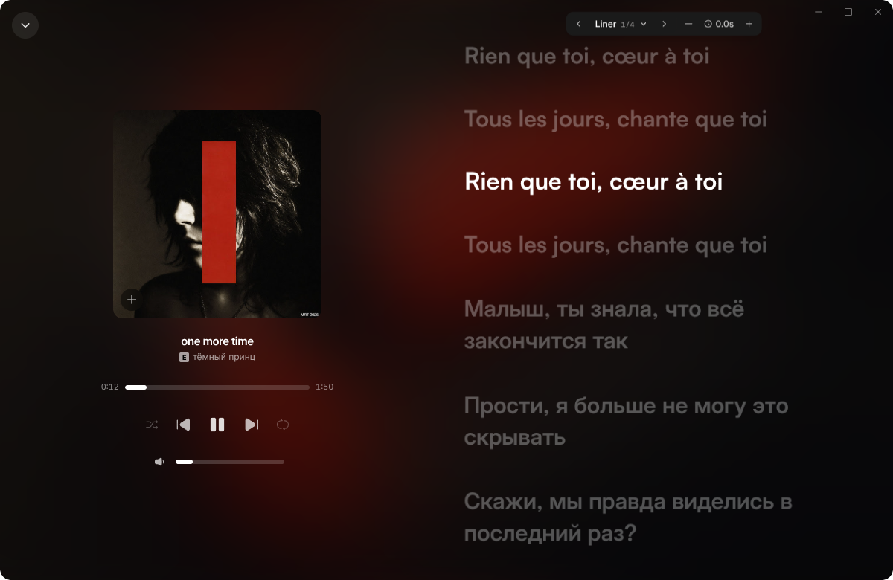
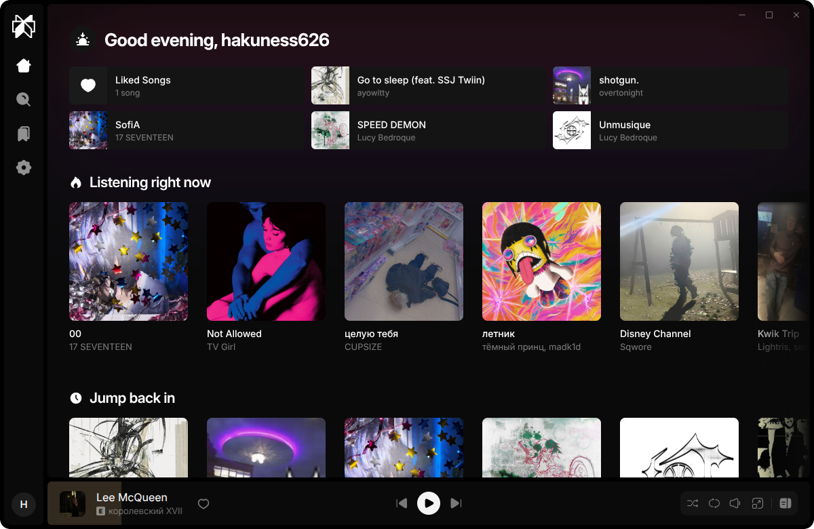
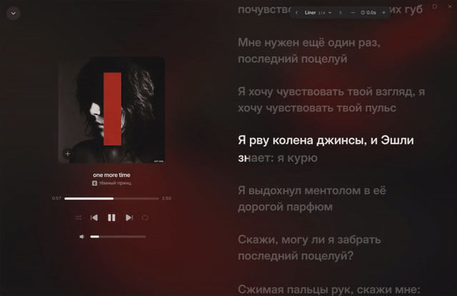

<div align="center">

# Liner

**Modern desktop music streaming player with syllable-synced lyrics and reactive dynamic visuals.**

[](https://electronjs.org)
[](https://react.dev)
[](https://www.typescriptlang.org)
[](https://tailwindcss.com)
[](https://webassembly.org)
[](./LICENSE)

[Preview](#preview) •
[Architecture](#architecture) •
[Getting Started](#getting-started) •
[Building](#building) •
[Contributing](#contributing) •
[License](#license)

<br/>



</div>

---

## Preview

<div align="center">
  <table>
    <tr>
      <td align="center" width="50%">
        
        <br/>
        <sub><b>Home</b></sub>
      </td>
      <td align="center" width="50%">
        
        <br/>
        <sub><b>Fullscreen mode</b></sub>
      </td>
    </tr>
  </table>
</div>

---

> [!NOTE]
> Liner client connects to the official Liner API backend for music catalog, streaming playback, and synchronized lyrics.

---

## Architecture

```
liner/desktop/
├── electron/
│   ├── main.ts              # Electron main process & IPC handlers
│   ├── preload.ts           # Context bridge & secure renderer bindings
│   ├── crypto.ts            # High-performance in-memory WebAssembly signer
│   └── signer.ts            # Embedded WebAssembly binary
├── src/
│   ├── assets/              # Static assets and media
│   ├── components/          # Shared reusable UI components
│   ├── features/            # Feature modules (player, lyrics, queue, library, search, auth)
│   ├── pages/               # Route views (Home, Search, Album, Artist, Playlist)
│   ├── shared/              # API client, state stores (Zustand), and data contracts
│   ├── App.tsx              # Application root
│   └── main.tsx             # Vite entry point
├── package.json
└── vite.config.ts
```

---

## Getting Started

### Prerequisites

- **Node.js** `v20+` and **pnpm** or **Bun**
- Modern OS (Windows 10/11, macOS, or Linux)

---

### Setup

```bash
# 1. Clone repository
git clone https://github.com/tryliner/desktop.git
cd desktop

# 2. Install dependencies (pnpm or Bun)
pnpm install
# or
bun install
```

---

### Running in Development

```bash
# Start Liner in development mode (Electron app with Vite hot-reload)
pnpm run dev
# or
bun run dev
```

---

## Testing

```bash
# Run test suite with Vitest
bun run test
# or
pnpm test
```

---

## Building

```bash
# Build desktop packages for your current OS:

# Linux (AppImage & .deb)
bun run electron:build:linux

# Windows (.exe installer)
bun run electron:build:win
```

Compiled distributions will be placed in the `release/` directory.

---

## Contributing

Contributions, bug fixes, and feature enhancements are welcome:

1. Fork the repository.
2. Create your feature branch (`git checkout -b feat/my-feature`).
3. Commit your changes (`git commit -m 'feat: add amazing feature'`).
4. Push to your branch (`git push origin feat/my-feature`).
5. Open a Pull Request to `tryliner/desktop`.

---

## Special Thanks

- [`@braccato/core`](https://github.com/better-lyrics/braccato) & `@braccato/parsers` — Synced lyrics components and format parsers.
- [`@kawarp/react`](https://github.com/better-lyrics/kawarp) & `@kawarp/core` — WebGL background shader components.
- [Solar Icons](https://solar-icons.com) & [MingCute Icons](https://www.mingcute.com) — Icon collections.

---

## License

Liner is distributed under the **Liner Source-Available & Non-Commercial Contribution License**.

- **Allowed**: Personal non-commercial usage, local builds, and upstream contributions.
- **Prohibited**: Commercial distribution, public competing forks, or extracting core algorithms for third-party products.

See [LICENSE](./LICENSE) for details.

